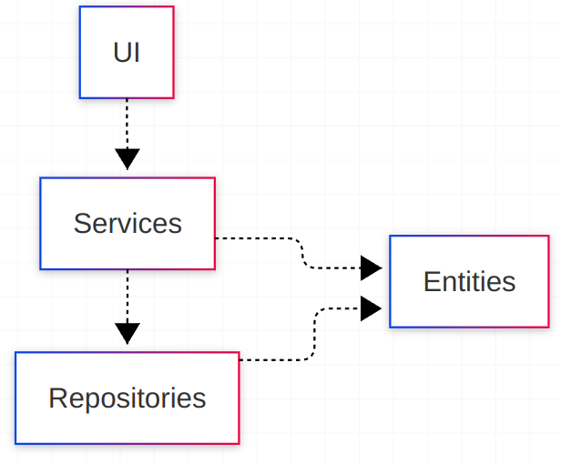
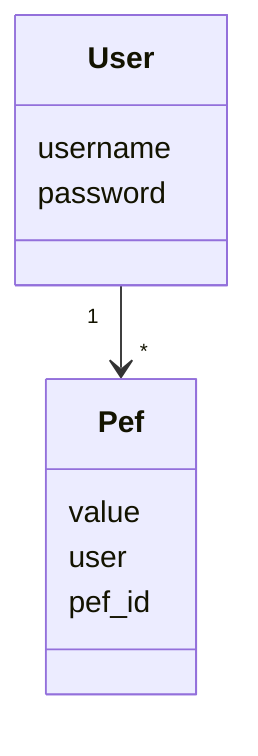
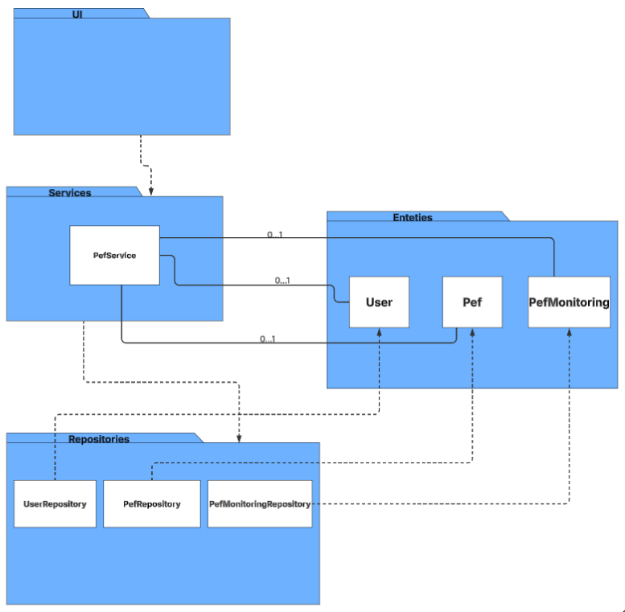
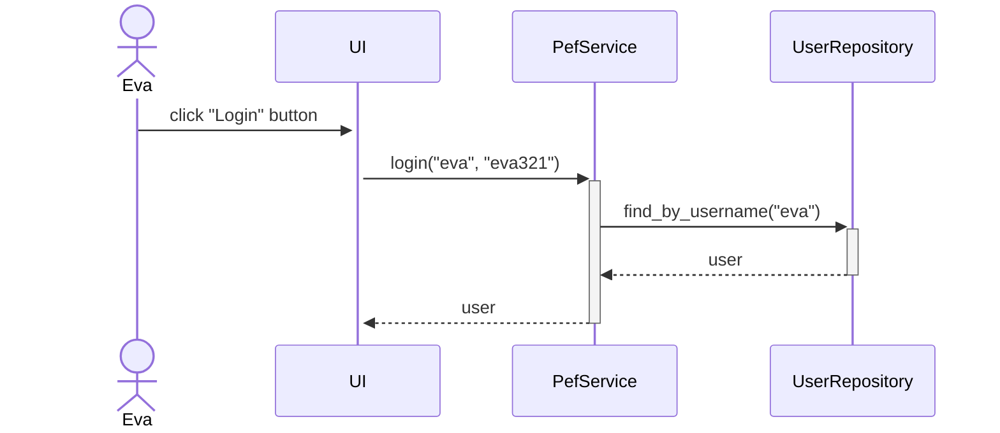
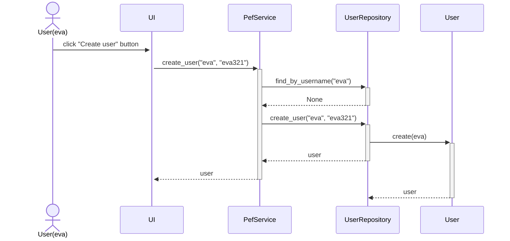
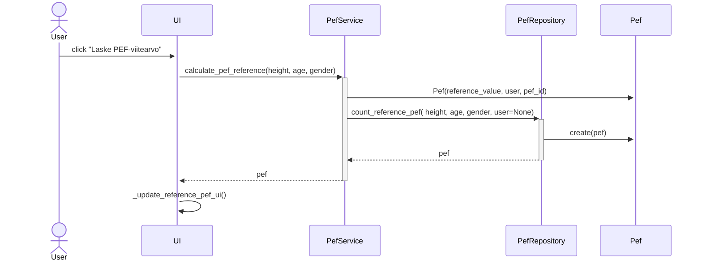

# Arkkitehtuurikuvaus

## Rakenne

Ohjelman rakenne noudattaa kolmitasoista kerrosarkkitehtuuria, ja koodin pakkausrakenne on seuraava:



Pakkaus ui vastaa käyttöliittymän toteutuksesta, pakkaus services sisältää sovelluslogiikan, ja pakkaus repositories huolehtii tietojen pysyväistallennuksesta. Pakkaus entities sisältää luokat, jotka edustavat sovelluksen käyttämiä tietokohteita.

## Käyttöliittymä

Käyttöliittymässä kolme erillistä näkymää:

- Kirjautuminen
- Uuden käyttäjän luominen
- Pef-toiminnot

Jokainen näkymä on toteutettu omana erillisenä luokkanaan. Vain yksi näkymä on aktiivisena kerrallaan, ja [UI](../src/ui/ui.py)-luokka huolehtii näkymien vaihtamisesta. Käyttöliittymä on täysin erotettu sovelluslogiikasta ja kommunikoi ainoastaan [PefService](../src/services/pef_service.py)-luokan tarjoamien metodien kautta.

Kun käyttäjä suorittaa PEF-toimenpiteen (esim. laskee referenssin tai tekee vertailuja), käyttöliittymä kutsuu PEFService-luokan vastaavia metodeja, kuten [calculate_pef_difference](https://github.com/JVilo/ot-harjoitustyo/blob/d49ccd076caaee7b330dac9481216666182a3d0e/src/services/pef_service.py#L110)ja [count_reference_pef](https://github.com/JVilo/ot-harjoitustyo/blob/d49ccd076caaee7b330dac9481216666182a3d0e/src/services/pef_service.py#L57), jotka huolehtivat PEF-arvojen laskemisesta ja vertaamisesta. Sovelluslogiikka suorittaa laskennan ja vertailun, ja sen jälkeen tulokset palautetaan käyttöliittymään, joka päivittää näkymän.

## Sovelluslogiikka

Sovelluksen loogisen tietorakenteen muodostavat luokat, kuten [User](https://github.com/JVilo/ot-harjoitustyo/blob/main/src/entities/user.py) ja [Pef](https://github.com/JVilo/ot-harjoitustyo/blob/main/src/entities/pef.py), jotka mallintavat käyttäjiä ja heidän PEF-arvojaan:



Sovelluksen keskeinen toiminnallisuus on toteutettu PefService-luokan ainoalla oliolla. Tämä luokka tarjoaa metodit kaikille käyttöliittymän toiminnoille, kuten:

- `login(username, password)`
- `create_user(username, password, password2)`
- `create_pef(value, user)`
- `get_user_pef()`
- `count_reference_pef(height, age, gender, user)`
- `calculate_pef_differences(morning_before, morning_after, evening_before, evening_after)`

_PefService_-luokka kommunikoi käyttäjätiedon ja PEF-tiedon kanssa repository-luokkien, kuten [PefRepository](https://github.com/JVilo/ot-harjoitustyo/blob/main/src/repositories/pef_repository.py) ja [UserRepository](https://github.com/JVilo/ot-harjoitustyo/blob/main/src/repositories/user_repository.py), kautta, jotka hoitavat tietojen pysyväistallennuksen. Nämä repositoryt injektoidaan sovelluslogiikkaan konstruktorin kautta.

`PefService`-luokan ja ohjelman muiden osien välinen suhde kuvataan seuraavassa luokka/pakkauskaaviossa:



## Tietojen pysyväistallennus

Pakkauksen **repositories** luokat `PefRepository` ja `UserRepository` huolehtivat tietojen tallentamisesta. `PefRepository`-luokka tallentaa tiedot tietokantaan, kun taas `UserRepository`-luokka käyttää SQLite-tietokantaa käyttäjien tietojen säilyttämiseen.

Nämä luokat noudattavat **Repository**-suunnittelumallia, jonka avulla tiedon tallennustavasta voidaan erottaa sovelluslogiikka. Tämä mahdollistaa tallennusratkaisujen vaihtamisen ilman, että sovelluslogiikkaa tarvitsee muuttaa. Esimerkiksi, jos sovelluksen tallennustapaa päätetään vaihtaa (esim. siirtyminen SQL-tietokannasta NoSQL-ratkaisuun), voidaan repository-luokkien toteutukset helposti vaihtaa uusiin ilman vaikutuksia muuhun sovellukseen.

Sovelluslogiikan testauksessa hyödynnetään tätä abstraktiota siten, että käytetään keskusmuistiin tallentavia repository-toteutuksia sen sijaan, että käytettäisiin oikeaa tiedostotallennusta tai tietokantaa.

### Tiedostot

Sovellus tallettaa käyttäjien ja PEF-arvojen tiedot erillisiin tiedostoihin.

Sovelluksen juureen sijoitettu konfiguraatiotiedosto `.env` määrittelee tiedostojen nimet.

Sovellus tallettaa PEF-arvot CSV-tiedostoon seuraavassa formaatissa:

```
5749b61f-f312-45ef-94a1-71a758feee2b;120.5;matti
65eef813-330a-4714-887b-2bda4d744487;115.7;kalle
```

Eli PEF-arvon id (`pef_id`), PEF-arvo (`value`, desimaaliluku) ja käyttäjän käyttäjätunnus (`username`). Kenttien arvot erotellaan puolipisteellä (`;`).

Käyttäjät tallennetaan SQLite-tietokannan tauluun `users`, joka alustetaan [initialize_database.py](https://github.com/JVilo/ot-harjoitustyo/blob/main/src/initialize_database.py)-tiedostossa.

## Päätoiminnallisuudet

Seuraavaksi kuvataan sovelluksen toimintalogiikka muutamien päätoiminnallisuuksien osalta sekvenssikaavion avulla.

### Käyttäjän kirjaantuminen

Kun käyttäjä syöttää käyttäjätunnuksen ja salasanan kirjautumisnäkymän kenttiin ja painaa Login -painiketta, sovelluksen kontrolli etenee seuraavasti:



Kun käyttäjä painaa kirjautumispainiketta, [tapahtumankäsittelijä](https://github.com/JVilo/ot-harjoitustyo/blob/main/src/ui/login_view.py) kutsuu sovelluslogiikan PefService-luokan metodia [login](https://github.com/JVilo/ot-harjoitustyo/blob/d49ccd076caaee7b330dac9481216666182a3d0e/src/services/pef_service.py#L79) ja antaa sille käyttäjätunnuksen ja salasanan parametreina. Sovelluslogiikka käyttää `UserRepository`:a tarkistaakseen, onko kyseinen käyttäjätunnus olemassa. Jos tunnus löytyy, verrataan salasanaa tallennettuun arvoon. Mikäli salasanat täsmäävät, kirjautuminen onnistuu. Tämän jälkeen käyttöliittymä siirtyy `PefsView`-näkymään ja näyttää kirjautuneelle käyttäjälle hänen PEF-arvonsa.

### Uuden käyttäjän luominen

Kun uuden käyttäjän luomisnäkymässä on syötetty käyttäjätunnus, joka ei ole jo käytössä sekä salasana, jonka jälkeen klikataan painiketta "Create", etenee sovelluksen kontrolli seuraavasti:



[Tapahtumakäsittelijä](https://github.com/JVilo/ot-harjoitustyo/blob/main/src/ui/create_user_view.py) kutsuu sovelluslogiikan [create_user](https://github.com/JVilo/ot-harjoitustyo/blob/d49ccd076caaee7b330dac9481216666182a3d0e/src/services/pef_service.py#L155)-metodia ja välittää siihen uuden käyttäjän tiedot. Sovelluslogiikka tarkistaa `UserRepository`:n avulla, onko annetulla käyttäjätunnuksella jo olemassa olevaa tiliä. Jos käyttäjätunnus ei ole käytössä, luodaan uusi `User`-olio, joka tallennetaan kutsumalla `UserRepository`:n `create`-metodia. Tämän jälkeen käyttöliittymä vaihtaa näkymäksi `PefsView`:n ja uusi käyttäjä kirjataan automaattisesti sisään.

### Pef-viitearvon laskeminen

Kun käyttäjä valitsee 'Laske PEF-viitearvo' -painikkeen, sovelluksen toiminta etenee seuraavalla tavalla:



[Tapahtumakäsittelijä]() kutsuu sovelluslogiikan metodia [calculate_pef_reference](https://github.com/JVilo/ot-harjoitustyo/blob/d49ccd076caaee7b330dac9481216666182a3d0e/src/services/pef_service.py#L57), antaen parametreina tarvittavat tiedot (esim. pituus, ikä, sukupuoli) PEF-viitearvon laskemiseksi. Sovelluslogiikka luo uuden `Pef`-olion kutsumalla `PefService`:n `create_pef`-metodia ja tallentaa sen kutsumalla `PefRepository`:n `create`-metodia. Tämän seurauksena käyttöliittymä päivittää näytettävän PEF-viitearvon kutsumalla omaa metodiaan _update_reference_pef_ui().

### Muut toiminnallisuudet

Sama periaate pätee kaikkiin sovelluksen toiminnallisuuksiin: käyttöliittymän tapahtumakäsittelijä kutsuu sovelluslogiikan metodia, joka puolestaan päivittää pefin tai kirjautuneen käyttäjän tilan. Kun kontrolli palaa takaisin käyttöliittymään, päivitetään tarvittaessa todo-lista ja aktiivinen näkymä.