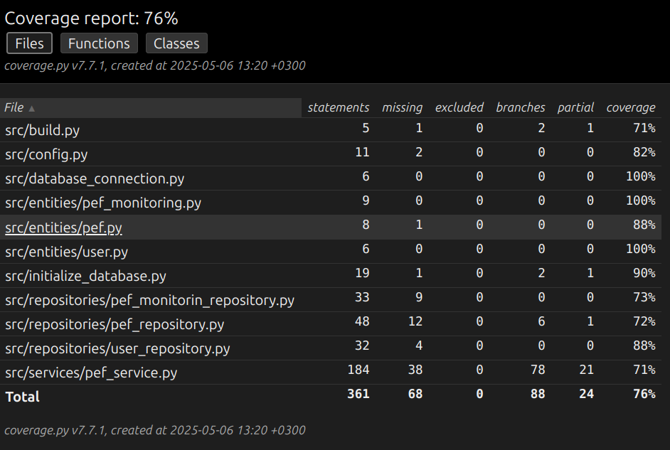

# Testausdokumentti

Sovellusta on testattu sekä automaattisilla yksikkö- ja integraatiotesteillä että manuaalisesti järjestelmätasolla unittestilla.

## Yksikkö- ja integraatiotestaus

### Sovelluslogiikka

Sovelluslogiikan osalta `PefService`-luokkaa testataan erikseen [TestPefService](https://github.com/JVilo/ot-harjoitustyo/blob/main/src/tests/services/pef_service_test.py)-testiluokalla. Tällöin luodaan `PefService`-olio, jolle injektoidaan mock-tyyppiset repositorio-oliot, jotka simuloivat reaalien repositorioiden käyttäytymistä. Tällöin hyödynnetään `MagicMock`-objekteja, jotka mahdollistavat repositorioiden toiminnan testaamisen ilman pysyväistallennusta.

### Repositorio-luokat

Repositorio-luokat kuten `PefMonitoringRepository`, `UserRepository` ja `PefRepository` testataan vain niiden osalta, jotka on konfiguroitu testitiedostoihin. Testissä käytettävät tiedostonimet on määritelty _.env.test_-tiedostossa. Joissain testeissä tiedostot luodaan myös dynaamisesti testin suorituksen aikana

- `PefMonitoringRepository`-luokkaa testaa [TestPefMonitoringRepository](https://github.com/JVilo/ot-harjoitustyo/blob/main/src/tests/repositories/pef_monitorin_repository_test.py).
- `UserRepository`-luokkaa testaa [TestUserRepository](https://github.com/JVilo/ot-harjoitustyo/blob/main/src/tests/repositories/user_repository_test.py).
- `PefRepository`-luokkaa testaa [TestPefRepository](https://github.com/JVilo/ot-harjoitustyo/blob/main/src/tests/repositories/pef_repository_test.py).

### Testauskattavuus

Sovelluksen kokonaiskattavuus ilman käyttöliittymää on 76 %.

Testaamatta jäi build.py- ja initialize_database.py-tiedostojen suorittaminen komentoriviltä. Nämä osat olisivat voineet jäädä testikattavuuden ulkopuolelle.Lisäksi testauksessa jäi käsittelemättä tilanteet, joissa kirjautumaton käyttäjä yrittää hakea jotain pef tietoa jota ei ole olemassa.
### Testaamatta jääneet tiedostot

UI-kansiossa olevat tiedostot eivät ole testattuja, joten niiden kattavuus puuttuu.

## Järjestelmätestaus

Sovelluksen järjestelmätason testaus on suoritettu manuaalisesti.

### Asennus ja konfigurointi

Sovellus on ladattu ja asennettu Linux-ympäristöön [käyttöohjeessa](https://github.com/JVilo/ot-harjoitustyo/blob/main/dokumentaatio/kayttoohje.md) kuvatuin tavoin. Testauksessa on otettu huomioon myös erilaiset konfiguraatiot _.env_-tiedoston määrittämillä arvoilla.

Sovellusta on testattu molemmilla tavoilla: tilanteissa, joissa tarvittavat tiedostot ovat valmiina, sekä tilanteissa, joissa ohjelma on itse luonut tiedostot alusta alkaen.

### Toiminnallisuudet

Kaikki [määrittelydokumentissa](https://github.com/JVilo/ot-harjoitustyo/blob/main/dokumentaatio/vaatimusmaarittely.md) ja käyttöohjeessa listatut toiminnallisuudet on testattu. Testauksessa on myös syötekenttiin syötetty virheellisiä arvoja, kuten tyhjiä kenttiä.

### Virhetilanteet

Sovellusta on testattu erilaisten virheellisten syötteiden osalta, kuten tyhjillä kentillä ja suurilla PEF-arvoilla. Ohjelma estää virheelliset syötteet käyttöliittymässä ja antaa tarvittaessa virheilmoituksia. Kuitenkin tietyt virheelliset syötteet, kuten äärimmäiset arvot, saattavat aiheuttaa virheellisiä laskelmia ilman varoituksia.

## Sovelluksen jääneet laatuongelmat

Sovellus ei tällä hetkellä tarjoa selkeitä virheilmoituksia seuraavissa tilanteissa:

- Konfiguraatiotiedostoihin ei ole riittäviä luku- tai kirjoitusoikeuksia
