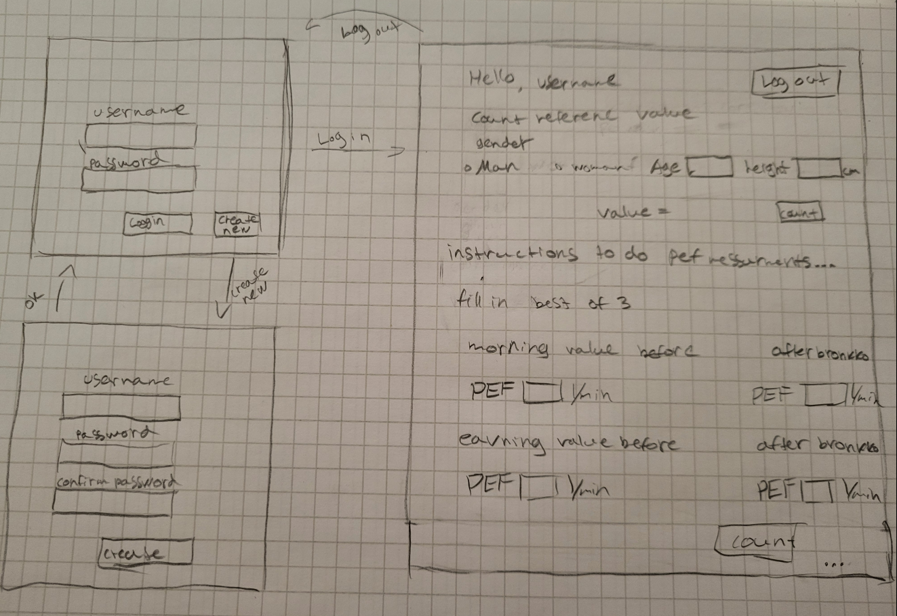

# Vaatimusmäärittely

## Sovelluksen tarkoitus

Sovelluksen avulla käyttäjä voi seurata omia pef-tuloksia ja nähdä oman keuhkofunktiotilanteen.&#10004; Useamman rekisteröityneen käyttäjän on mahdollista käyttää sovellusta. &#10004; Käyttäjät näkevät vain omat pef-tulokset.&#10004;

## Käyttäjät

Sovellusta käytetään ainoastaan _tavalliset käyttäjät_. &#10004; 

## Käyttöliittymäluonnos

Sovelluksessa tulee olemaan kolme näkymää. &#10004;

Sovellus aukeaa kirjautumisnäkymään, josta voi mennä luomaan uuden käyttäjän _luo uusi_ -näkymään tai sisäänkirjautumisen jälkeen käyttäjännäkymään. &#10004;

## Perusversion tarjoama toiminnallisuus

### Ennen kirjautumista

- Jos käyttäjätunnusta ei ole, voi käyttäjä luoda käyttäjätunnuksen.&#10004; Käyttäjätunnus ei voi olla jo järjestelmässä oleva tunnus ja sen tulee olla vähintään 3 merkkiä pitkä.&#10004;
- Käyttäjä voi kirjautua järjestelmään, jos tunnus on jo olemassa.&#10004;
- Jos käyttäjätunnusta ei ole tai salasana on virheellinen kirjautuessa, järjestelmä ilmoittaa tästä.&#10004;

### Kirjautumisen jälkeen

- Käyttäjä voi laskea oman pef-viitearvon, kun ohjelmaan syötetään oma ikä, sukupuoli (syntymä) ja pituus.&#10004;
- Ohjelmaan voi syöttää yksittäisiä pef-puhallusten tuloksia (aamun paras ennen lääkettä ja lääkkeen jälkeen sekä illan paras ennen lääkettä ja lääkkeen jälkeen, tai vain ilman lääkettä, jos haluaa seurata vuorokausivaihtelua). &#10004;
    - Ohjelma kertoo käyttäjälle, miten sitä tulee käyttää.&#10004;
- Ohjelma huomauttaa, jos pef-seurannassa ilmenee tiettyjen rajojen ylittäviä vaihteluita painamalla "laske tulokset". &#10004;

## Jatkokehitysideoita

Jos aikaa jää perusversion luomisen jälkeen, ohjelmaa voidaan täydentää esimerkiksi seuraavilla toiminnoilla:

- Käyttäjä voi valita, kuinka pitkän pef-seurannan haluaa tehdä ja täyttää sen. Seurannan täyttöä voi jatkaa myöhemmin, ja kun seuranta on tehty, sitä voi katsella jälkikäteen.&#10004;
- Käyttäjä voi nähdä taulukossa, miten tulokset muuttuvat.
- Käyttäjä voi tulostaa pef-seurannan tuloksista raportin.
- Käyttäjä voi katsoa pitkän aikavälin tilastotietoja tuloksistaan.