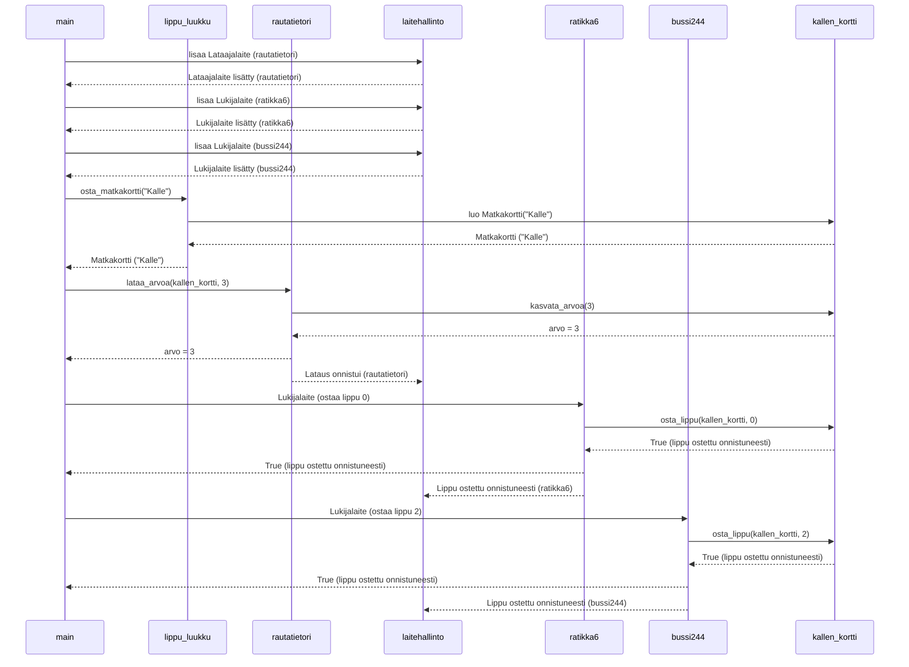

```mermaid
    sequenceDiagram
    participant M as main
    participant K as lippu_luukku
    participant L as rautatietori
    participant KH as laitehallinto
    participant LU1 as ratikka6
    participant LU2 as bussi244
    participant MK as kallen_kortti

    M->>KH: lisaa Lataajalaite (rautatietori)
    KH-->>M: Lataajalaite lisätty (rautatietori)
    
    M->>KH: lisaa Lukijalaite (ratikka6)
    KH-->>M: Lukijalaite lisätty (ratikka6)
    
    M->>KH: lisaa Lukijalaite (bussi244)
    KH-->>M: Lukijalaite lisätty (bussi244)

    M->>K: osta_matkakortti("Kalle")
    K->>MK: luo Matkakortti("Kalle")
    MK-->>K: Matkakortti ("Kalle")
    K-->>M: Matkakortti ("Kalle")

    M->>L: lataa_arvoa(kallen_kortti, 3)
    L->>MK: kasvata_arvoa(3)
    MK-->>L: arvo = 3
    L-->>M: arvo = 3
    L-->>KH: Lataus onnistui (rautatietori)

    M->>LU1: Lukijalaite (ostaa lippu 0)
    LU1->>MK: osta_lippu(kallen_kortti, 0)
    MK-->>LU1: True (lippu ostettu onnistuneesti)
    LU1-->>M: True (lippu ostettu onnistuneesti)
    LU1-->>KH: Lippu ostettu onnistuneesti (ratikka6)

    M->>LU2: Lukijalaite (ostaa lippu 2)
    LU2->>MK: osta_lippu(kallen_kortti, 2)
    MK-->>LU2: True (lippu ostettu onnistuneesti)
    LU2-->>M: True (lippu ostettu onnistuneesti)
    LU2-->>KH: Lippu ostettu onnistuneesti (bussi244)

```